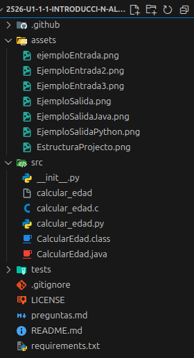
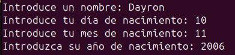
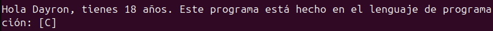

[](https://classroom.github.com/a/F4zkDqTW)
[](https://classroom.github.com/online_ide?assignment_repo_id=20998083&assignment_repo_type=AssignmentRepo)
# Práctica 2: Introducción al desarrollo. Ponlo en práctica.

Apoyate en los siguientes recursos para realizar la práctica:

[Descripción de la práctica](https://revilofe.github.io/section3/u01/practica/EDES-U1.-Practica011/)


---

# Título de la Actividad

## Identificación de la Actividad
- **ID de la Actividad:** 2526-u1-1-1
- **Módulo:** EDES
- **Unidad de Trabajo:** UD 1 - Introducción al desarrollo de software

- **Fecha de Creación:** 11/10/2025
- **Fecha de Entrega:** 15/10/2025
- **Alumno(s):** 
  - **Nombre y Apellidos:** Dayron Torres Yegua
  - **Correo electrónico:** dtoryeg519@g.educaand.es
  - **Iniciales del Alumno/Grupo:** DTY

## Descripción de la Actividad
La actividad consiste en el desarrollo de un programa sencillo en diferentes tipos de lenguaje y asi poder visualizar las diferencias en el codigo y a la hora de ejecutarlo ya que son 3 tipos de lenguaje diferente.

## Instrucciones de Compilación y Ejecución
1. **Requisitos Previos:**
   - Lenguaje de programacion C, version gcc (Ubuntu 13.3.0-6ubuntu2~24.04) 13.3.0
   - Lenguaje de Java
   - Visual studio code haciendo uso de el paquete de extension de c para este mismo
   - IntelijIdea Ultimate para Java

2. **Pasos para Compilar el Código:**
- En C
   ```bash
   gcc calcular_edad.c -o calcular_edad
   ```
- En Java

   ```bash
   javac CalcularEdad.java
   ```

3. **Pasos para Ejecutar el Código:**
- En C

   ```bash
   ./calcular_edad
   ```
- En Java 

   ```bash
   java CalcularEdad
   ```

## Desarrollo de la Actividad
### Descripción del Desarrollo

- Para la estructura del codigo se ha decidido usar una la cual divide los diferente archivos del project en los siguiente:

   - Carpeta de assets donde se guardarán las imagenes a utilizar
   - Carpeta src donde estarán los diferentes archivos que contengan codigo de nuestro projecto
   - Carpeta de test donde estarán los archivos dedicados al testing en caso de hacerlos
   - Los demas archivos están en la raiz del proyecto como pueden ser el archivos de preguntas el cual contiene las preguntas a realizar de la practica o el readme donde se detallará todo el contenido de la practica.

   - Imagen de estrcutura del projecto:

         

### Código Fuente

- Codigo fuente python

https://github.com/IES-Rafael-Alberti/2526-u1-1-1-introducci-n-al-desarrollo-DayronTorresYegua/blob/940f1d755a653963d0e685e5bbe50190a21aa769/src/calcular_edad.py#L1-L25

- Codigo fuente C

https://github.com/IES-Rafael-Alberti/2526-u1-1-1-introducci-n-al-desarrollo-DayronTorresYegua/blob/d0a445be81e6de2a259473480e00feefde4ad108/src/calcular_edad.c#L1-L38

- Codigo fuente Java

https://github.com/IES-Rafael-Alberti/2526-u1-1-1-introducci-n-al-desarrollo-DayronTorresYegua/blob/d0a445be81e6de2a259473480e00feefde4ad108/src/CalcularEdad.java#L1-L31

### Ejemplos de Ejecución
- **Entrada 1:** 

   

- **Salida Esperada 1:**

   
   
   - La salida es asi debido a que al tomar los valores de entrada el programa calcula la edad que tienes comparando tu fecha de nacimiento con la fecha al momento de ejecutar el programa

   
## Conclusiones

- La conclusiones sacadas de esta practica son que al haber trabajado con diferentes tipos de lenguaje podemos darnos cuenta de las diferencias que tiene cada uno, como pueden ser la sintaxis, enfoques que tiene paradigmas a los que van dirigidos etc... Cada uno de ellos tienen usos diferentes formas de ejecucion diferentes, esta practica a servido para conocer los diferentes tipos de lenguajes que nos podemos encontrar.